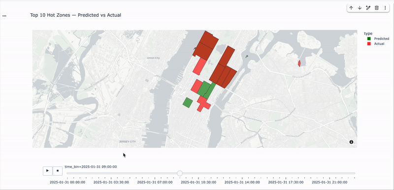

# NYC Taxi Hotspot Prediction 🚕📍
**Real-time 15-minute demand hotspot prediction using PySpark + Kafka**

## 🧩 Problem Statement

Taxi demand in NYC shifts every few minutes across zones, but most operational decisions for yellow cabs are reactive.

- Drivers guess where to find the next ride  
- Fleet operators lack visibility into demand movement  
- Aggregators cannot proactively manage distribution or pricing  
- 15+ years of TLC trip data is rarely used for real-time operational intelligence  

What’s missing is a **zone-level demand prediction system** that can power positioning, allocation, and pricing decisions **before** demand spikes.

## ⚙️ What This Project Does

This project builds a **batch + streaming ML system** that predicts which NYC taxi zones will be busiest in the next **15 minutes**.

- Processes historical TLC data with PySpark  
- Creates spatiotemporal features at `(zone, 15-min window)`  
- Trains an ML model to predict future trip counts per zone  
- Uses Kafka to simulate live trip streams  
- Runs PySpark Structured Streaming for real-time inference  
- Continuously outputs **live hotspot zones**  
- Displays predictions on a NYC map in real time 🗺️  

### This system can be used by:

- 🚖 Drivers for positioning  
- 🚚 Fleet operators for allocation  
- 📈 Aggregators for pricing & surge strategy  
- 🏙️ City planners for mobility insights

### How to Run

1️⃣ Import the Model
Run the Python file NYCTaxiHotSpotPrediction. Import the model in Consumer.

2️⃣ Start Kafka
<code>kafka-topics --create --topic taxi_stream --bootstrap-server localhost:9092</code>

3️⃣ Start Producer (Simulated Live Data)
cd Producer
<code>python TaxiDataStream.py</code>

4️⃣ Start Consumer (Real-Time Prediction)
cd Consumer
<code>spark-submit HotspotConsumer.py</code>

## Output

Visualization for hotspot prediction for streaming data

Predicted vs Actual NYC Taxi Hotspots (5-min window)
This view compares predicted (green) and actual (red) demand zones per time bin across TLC regions. The strong overlap demonstrates the model’s ability to reliably forecast short-term taxi demand using streaming trip data and spatiotemporal features. These results validate the system’s usefulness for real-time driver positioning, fleet allocation, and dynamic pricing decisions.

Tech Stack

Data & ML: PySpark, PySpark MLlib, Pandas, GeoPandas
Streaming: Apache Kafka, PySpark Structured Streaming
Visualization: Plotly, Matplotlib
Language: Python
